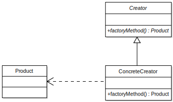

#---Builder pattern---
##Описание
Дизайн патърна builder  се използва за създаване на обекти. Целта е чрез преминаване на последователност от различни стъпки да се създаде различен обект. Използва се когато трябва да се създадат множество компоненти, за да бъде създаден един продукт. Позволява на клиента да изгради сложен обект, като се посочва само неговия вид и съдържание, без детайли за това как се изгражда.
##UML диаграма:
</img>
#Описание на елементите в диаграмата:
- **Builder** – представлява абстрактен клас за създаване на части от Product.
- **ConcreteBuilder** – създава части от Product, като имплементира интерфейса Builder. Дефинира и следи създадената част от продукта. Има интерфейс за вземане на продукта.
- **Director** – създава обект използвайки интерфейса Builder.
- **Product** – представлява конкретния обект, който се създава.

#---Factory Method---
##Описание
Използва се за създаване на обекти без да се посочва конкретния клас. Същността на този патърн е да дефинира интерфейс за създаване на обекти и оставянето на отговорността решението кой клас да бъде инстанциран, на класовете, които имплементират този интерфейс.
##UML диаграма:
</img> 
##Изпълнение: 
клиентът се нуждае от продукт, но вместо да го създава директно с помощта на оператора new, той иска фабриката да го създаде, като предоставя информация за типа на продукта. Фабриката създава нов конкретен продукт и след това се връща на клиента. Клиентът използва продуктите като абстрактни продукти, без да е наясно с конкретната им имплементация.
##Недостатъци: 
- Не може да се използва със singleton.
- Трябва да се инициализира преди да се използва.
- Ако трябва да се добави нов обект то първо трябва да се създаде нов factory.

#---Abstract Factory---- 
##Описание
Използва се за създаване на обекти. Целта на този шаблон за дизайн е да изолира създаването на обектите от тяхното използване.
Абстрактната фабрика капсулира група от методи Фабрика, имащи близко предназначение. Клиентският код създава конкретна имплементация на абстрактната фабрика, след това използва основния интерфейс за да създава конкренти обекти. Клиентът не е задължен да знае коя от тези фабрики е създала конкретния обект, защото той използва само основния интерфейс към създадените обекти.
Този шаблон позволява замяната на конкретни класове, дори по време на изпълнение, без да е нужна промяна на кода, който ги използва. Това обаче е за сметка на на допълнително усложняване на кода, което не е много желателно.
##UML диаграма:
</img>