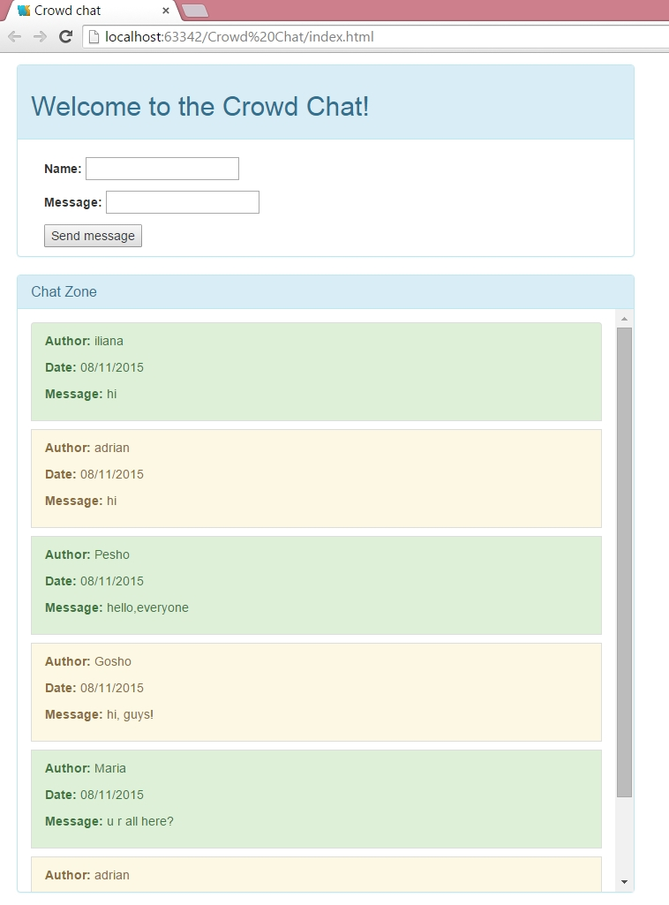

# HOMEWORK - Single Page Applications

Create a SPA application "Crowd Chat".
The application must use the following web services:

**GET** http://crowd-chat.herokuapp.com/posts -
Return all posts

**POST** http://crowd-chat.herokuapp.com/posts
Body: { 

"user": "USER_NAME", 

"text": "MESSAGE_TEXT"

} -
 Sends a new post

### THE RESULT:

